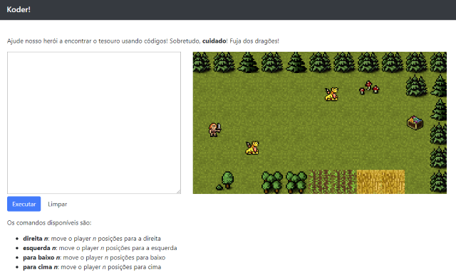

# koder

O *koder* é um jogo em que você tem que movimentar o player utilizando comandos de uma linguagem de programação. Os comandos disponíveis são:

* `direita n`: move o player `n` unidades para a direita
* `esquerda n`: move o player `n` unidades para a esquerda
* `para baixo n`: move o player `n` unidades para baixo
* `para cima n`: move o player `n` unidades para cima

## Exemplo

O exemplo a seguir é um programa que move o player 10 unidades para a direita, 5 unidades para baixo, 5 unidades para a esquerda e 5 unidades para cima.

```
direita 10
para baixo 5
esquerda 5
para cima 5
```

## Antlr

O koder foi criado com base em uma gramática do [**antlr**](http://antlr.org). Ela está disponível no arquivo [grammar/Koder.g4](grammar/Koder.g4)

O koder utiliza o padrão *visitor* para percorrer a AST gerada pelo parser a partir da entrada e executa ações no contexto de um jogo que é implementado utilizando [**phaser**](http://phaser.io).

O resultado é um jogo HTML cuja mecânica dos controles envolve movimentar o player utilizando os comandos da linguagem de programação. A figura a seguir ilustra a tela do jogo.



## Ferramentas

Para que o software funcione é necessário fazer download do [ANTLR runtime para JavaScript](https://www.antlr.org/download/antlr-javascript-runtime-4.7.2.zip) e também utilizar um servidor web para arquivos estáticos (como o *HttpServer* ou a extensão *Live Server* para o VSCode). 

O runtime deve ser descompactado na pasta raiz do software (criando o caminho `./antlr4`).

O software também utiliza a biblioteca *require.js* disponibilizada no repositório do [antlr](https://github.com/antlr/antlr4/blob/master/runtime/JavaScript/src/lib/require.js) (não é necessário fazer download dela, pois já está em `./lib/require.js`).

## Nota

Este software é uma demonstração dos conceitos de compiladores e da utilização do ANTLR para criá-los (análise léxica, análise sintática, análise semântica, gramática).

